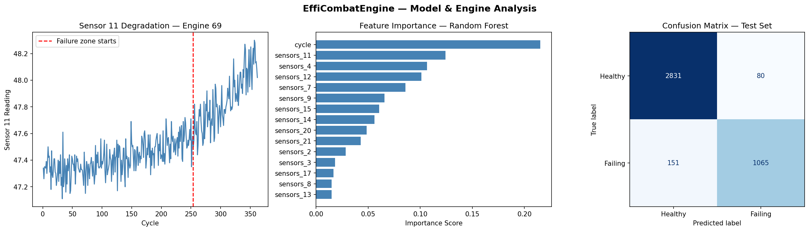
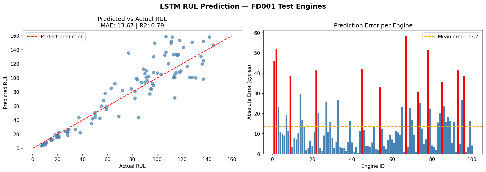
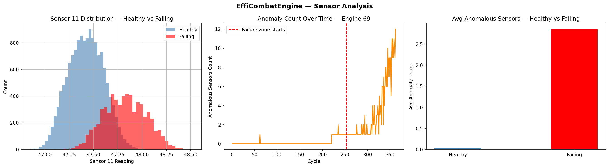
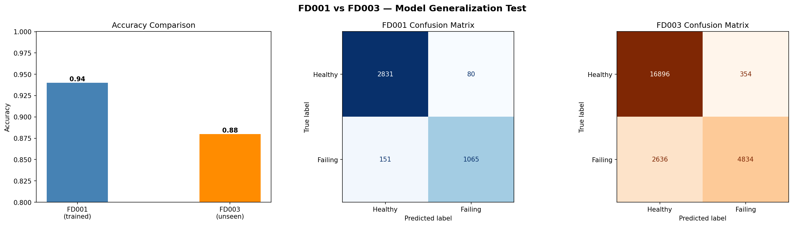
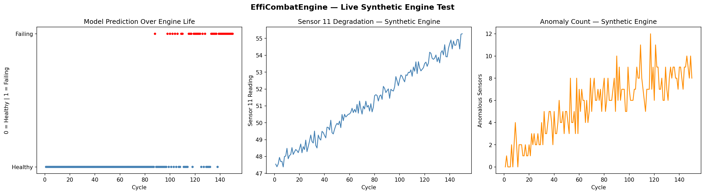

# C-mapss-predictive-maintenance
### EffiCombatEngine — Turbofan Engine Health Monitoring

Predicting jet engine failure before it happens using NASA sensor data.
Built from scratch on the C-MAPSS FD001 dataset. 

---

## What it does

Takes real turbofan engine sensor readings and tells you:
- Is this engine healthy or about to fail?
- How many cycles does it have left?
- Which sensors are behaving abnormally?

---

## Dataset

NASA C-MAPSS FD001 —>> 100 engines run until failure, 21 sensors, 26 columns.
No labels provided. Everything engineered from scratch.
Generalization tested on FD003 — different fault modes, zero retraining.

---

## Results

| Test | Result |
|---|---|
| Classification FD001 train/test | 94% / 93% |
| Generalization on FD003 | 88% |
| RUL Regression MAE | 13.67 cycles |
| RUL R2 Score | 0.79 |
| Anomaly spike at failure | 106x |
| Early warning lead time | 17 cycles |

---

## What I built

**1. Data Prep**
- Loaded raw unlabeled sensor data with no headers
- Dropped sensors with near-zero variance using std threshold
- Calculated RUL = max_cycle - current_cycle
- Labeled last 30% of each engine's life as failing

**2. Failure Classification — Random Forest**
- 94% accuracy on train/test split
- 93% on 100 completely unseen test engines
- 88% on FD003 with different fault modes, no retraining

**3. RUL Regression — LSTM**
- Sliding window of 30 cycles as input sequences
- MAE: 13.67 cycles, R2: 0.79
- Best prediction: engine 43, error of 0.4 cycles
- Random Forest, XGBoost, MLP all plateaued at MAE ~20
- LSTM broke through by learning temporal degradation patterns

**4. Anomaly Detection — Z-Score**
- Healthy baseline computed from healthy cycles only
- Flagged sensors beyond ±3 std as anomalous
- Healthy engines: avg 0.03 anomalous sensors per cycle
- Failing engines: avg 2.85 — 106x spike
- Most critical sensors: sensors_9, sensors_11, sensors_14

**5. Generalization Test — FD003**
- Same trained model, different engines, different fault modes
- 88% accuracy with no retraining
- High precision on failure detection (0.93) —>> low false alarms

**6. Synthetic Engine Test**
- Simulated a degrading engine over 150 cycles
- Model flagged failure at cycle 88
- Actual failure zone starts at cycle 105
- 17 cycle early warning lead time

---

## Why LSTM beat everything else

| Model | MAE | R2 |
|---|---|---|
| Random Forest | 19.89 | 0.60 |
| XGBoost | 21.55 | 0.54 |
| MLP | 21.78 | 0.53 |
| **LSTM** | **13.67** | **0.79** |

Single snapshots lose temporal context. 
LSTM uses 30-cycle windows sees how sensors trend over time, not just current values.

---

## Limitations

- Trained on single fault mode. Performance drops on multi fault data.
- RUL regression can improve with attention mechanisms or transformers.
- No real time inference pipeline yet.

---

## Stack

Python, Pandas, NumPy, Scikit-learn, TensorFlow/Keras, Matplotlib

---

## Files

- `cmapss_analysis.ipynb` — full notebook
- `efficombat_model.pkl` — Random Forest classifier
- `efficombat_lstm.keras` — LSTM regression model
